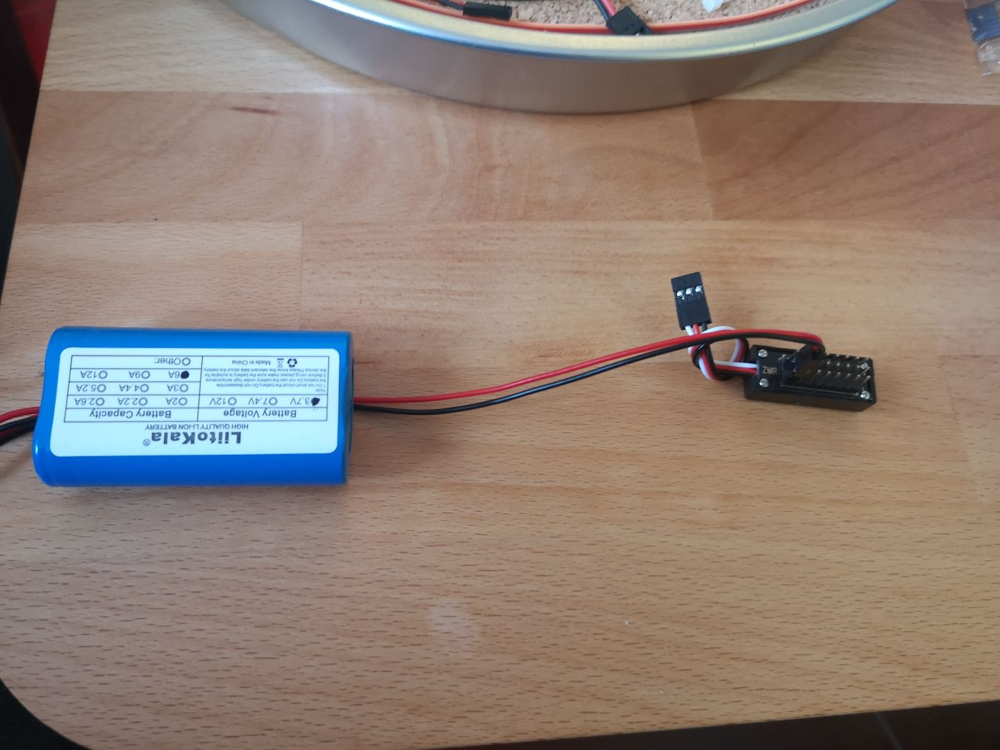

# Minus-Type Vigibot robot for Botkins

[COLLAPSE / EXPAND]

### Table of Contents
- [General Info](#general-info)
- [Prerequisites](#prerequisites)
- [Partlist](#partlist)
  - [Core Parts](#core-parts)
  - [Power Distribution Board Parts](#power-distribution-board-parts)
  - [Motor Base Parts](#motor-base-parts)
  - [Head Parts](#head-parts)
  - [Gripper Parts](#gripper-parts)
  - [Optional Parts](#optional-parts)
- [Minus-Type Assembly](#minus-type-assembly)
  - [Software Install](#software-install)
  - [Motor Base Assembly](#motor-base-assembly)
  - [Head Assembly](#head-assembly)
  - [Gripper Assembly](#gripper-assembly)
  - [Power Distribution Board Assembly](#power-distribution-board-assembly)
  - [Final Assembly](#final-assembly)
- [Credits](#credits)

### General Info
Learn more about Botkins Charity Project on the Hackaday Page https://hackaday.io/project/180558-botkins-charity-project  
Learn more about Vigibot https://www.robot-maker.com/forum/topic/13010-what-is-vigibot-quest-ce-que-vigibot/

Basis is the Standard Vigibot Minus-Type (pictured), but with a LTE/4G stick and without lateral (side) arms

If you'd like to build a robot for Botkins, contact us and we'll send you the Onboarding Process. Let us know about any broken links. The maker can choose the 3D printed parts color.

### Prerequisites
You need:
- Soldering iron. 
- Internet Access (SIM card with mobile data, WLAN or Ethernet LAN), PC.
- 3D Printer currently not required.
- Tools: Screwdrivers, adjustable / monkey wrench, tweezers, duct tape, ...

# Partlist

[COLLAPSE / EXPAND]

#### Core Parts

- 1x Raspberry Pi 3B, 3B+ or 4B (1GB or 2GB. the higher memory variants are unnecessarily expensive. Requires 2 USB ports.)
  - https://www.robot-maker.com/shop/cartes-programmables/241-raspberry-pi-3b-plus-241.html
  - Switzerland: https://www.galaxus.ch/de/s1/product/raspberry-pi-3-model-b-entwicklungsboard-kit-8024081
  - Germany: https://www.reichelt.de/ch/de/raspberry-pi-3-b-4x-1-4-ghz-1-gb-ram-wlan-bt-raspberry-pi-3b--p217696.html

- 1x Huawei E3372h LTE/4G mobile data stick (without SIM card)
  - The newest model "e3372h-325 (Brand: Brovi)" doesn't work. The older models are no longer manufactured. 
  - Find a suitable model on secondhand platforms or ask Botkins for the time being.
  - Model must be "e3372h-153", "e3372h-320" or "e3372h-607". The model is printed onto the SIM slot beneath the lid.

- 1x USB - USB 90° adapter
  - "Color : Adapter", "Cable Length : Down" https://www.aliexpress.com/item/1005006057729975.html

- USB bracket holder
  - https://www.robot-maker.com/shop/impression-3d/261-service-impression-3d-pla-261.html Note in order or send an E-Mail to impression3D@robot-maker.com with your order number and text: "Custom part order for USB_bracket holder"
  - or 3D print file "stl/usb_bracket.stl"
  - or ask in the Botkins Signal group

- 1x USB Microphone "Super AI".
  - https://www.robot-maker.com/shop/composants/446-microphone-usb-446.html
  - "Orange" or "Black" https://www.aliexpress.com/item/1005007114049915.html
  - If they aren't available, check with Botkins.

- 1x 16-32GB MicroSD card. Strongly Recomnended is the "WesternDigital Purple" (presumed resilient against data corruption, as few as 50 reboots can cause a startup failure on cheap cards!), or another "Endurance" type card. 
  - Switzerland: https://www.galaxus.ch/de/s1/product/wd-wdd032g1p0c-microsdhc-32-gb-u1-uhs-i-speicherkarte-13745268

- if you don't already have one: a micro SD card reader.
  - "Color : Only USB3.0" https://www.aliexpress.com/item/32832711883.html

- 1x aftermarket wide-angle lens camera module
  - with IR-cut filter. There is only one camera module v1 clone that combines a wide-angle lens and a motorized IR-cut filter at the time of writing
  - Robot-Maker:
    - https://www.robot-maker.com/shop/capteurs/311-camera-raspberry-pi.html
    - AND "30cm" https://www.robot-maker.com/shop/composants/329-nappe-raspberry-pi.html#/92-longueur-30cm
  - "Option 2" https://aliexpress.com/item/32881466491.html

- 1x Geekworm / U-geek UPS Hat V3 with 2x20 pin header 15mm pin length extension
  - https://www.robot-maker.com/shop/shield/341-ups-hat-pour-raspberry-pi-341.html
  - aliexpress:
    - https://aliexpress.com/item/4001113371912.html
    - AND https://www.robot-maker.com/shop/composants/451-header-2x20-a-pins-long-451.html
      - i have not been able to find 15mm pin length (total part length ~23.5mm) header on aliexpress yet.
  - https://www.amazon.fr/gp/product/B089NF1NHS

- 1x 1S2P battery pack with protection. if from AliExpress, use Liitokala Brand. Maybe add 1x spare, Liion in use last about 2-3 years until capacity drops to 50%.
  - https://www.robot-maker.com/shop/alimentation/383-batterie-lithium-ion-1s2p-ncr-383.html
  - Switzerland: https://www.galaxus.ch/de/s1/product/ansmann-1s2p-akkupack-2x-18650-kabel-li-ion-37-v-5200-mah-18650-5200-mah-akku-akku-ladegeraet-14527956
  - "1S2P 6000mAh" https://www.aliexpress.com/item/4001116123943.html

- 2x USB charger (QC3.0 or newer must support 12V/1.2A or more). (so the recipient gets 1x spare)
  - "EU" https://aliexpress.com/item/4000045865332.html
- 2x USB magnetic cable 4-pin (so the recipient gets 1x spare)
  - "Color : ___ type c", "Length : 2m(6.6ft)" https://www.aliexpress.com/item/4001224959039.html

- 1x Active buzzer 3V or 5V, connect to GND and GPIO 18.
  - "actif" https://www.robot-maker.com/shop/accessoires-robotiques/487-buzzer-5v-487.html
  - "3v" https://www.aliexpress.com/item/4000829554492.html

- About 10cm adhesive Velcro tape, to fix battery pack to middle plate.
  - "White 1Meter", "25mm Wide" https://www.aliexpress.com/item/1005006680575466.html

- if you don't already have: A bit of gorilla / super glue (glue LED caps onto LED board so they don't fall off)
  - https://aliexpress.com/item/1005002488174010.html

#### Power Distribution Board Parts

- Splitter Board
  - "Color : 1 pcs" https://www.aliexpress.com/item/1005006042011391.html

- PH2.0 to 2 Pin cable
  - "Color : 2P", "Length : 10CM" https://www.aliexpress.com/item/1005002901249753.html (check polarity during assembly, it usually has to be inverted)

- 8-16x DuPont cables.
  - "30cm" or "20cm" https://www.robot-maker.com/shop/composants/42-nappe-40-fils-femelle-femelle-42.html
  - "F-F (30 cm)" https://www.pololu.com/product/4566
  - "30CM F-F" https://www.aliexpress.com/item/32823004985.html

- About 5x Single DuPont pin sleeves
  - "1P" https://aliexpress.com/item/33035707563.html

<s>

OLD: manually soldered PDB [Expand]

- Find Build instructions and pictures on botkins cloud in /Hardware_Design/UPS_power_distribution/

- 1x small piece of prototyping board for the power distribution board. Build a small 2-row header board with 1x soldered wires for the UPS and 6-8x pin header slots (1x battery, 4x servo, 1x motor driver, 1x spare). insulate backside with duct tape to prevent accidental short circuits.
  - https://aliexpress.com/item/1005001807612572.html

- 1x Pin header for the power distribution board
  - https://www.robot-maker.com/shop/composants/93-barrette-secable-male-254mm-93.html
  - "CAIpaizhen" https://aliexpress.com/item/32744837236.html

- 1x PH2.0 plug to connect the power distribution board to the geekworm v3 UPS.
  - "2P" https://aliexpress.com/item/4000091077742.html

</s>

#### Motor Base Parts

- 3D printed parts, screws, nuts and standoffs 
  - Full kit : https://www.robot-maker.com/shop/kits-robots/425-kit-chassis-4wd-minus-425.html
  - List :
    - 3D printed parts : 4  ( Top, middle, bottom and rear plate )
    - 12mm length M2.5 male standoffs between the Raspberry PI and UPS hat board : 4
    - 25mm length M2.5 male standoffs between the UPS hat board and middle plate : 4
    - 10mm length M2.5 female standoffs between the middle plate and bottom plate : 4
    - 5mm length M2.5 male standoffs between the Raspberry PI board and top plate : 4
    - 6 mm M2.5 screw : 10 ( 4 top plate / 4 bottom plate / 2 middle plate)
    - 8 or 10 mm M2.5 screw to fix motor board : 2 
    - M2.5 nut : 6 ( 4 for the motor board / 2 middle plate)
    - 8mm length M2 screw to fix the back plate on the middle plate : 3 
    - M2 nut : 3

- 4x Pololu 100:1 micro metal gearmotor HP 6V
  - https://www.robot-maker.com/shop/moteurs-et-actionneurs/384-moteur-pololu-300-rpm.html (provided with cable you need to solder, but can be provided soldered)
  - https://www.pololu.com/product/1101
- 4x Pololu micro metal gearmotor extended bracket (provided with screws and nuts)
  - https://www.robot-maker.com/shop/elements-mecaniques/385-support-moteur-pololu-long.html
  - https://www.pololu.com/product/1089
- 4x Pololu wheel 40×7mm
  - https://www.robot-maker.com/shop/elements-mecaniques/346-roue-pololu-40mm.html  
  - https://www.pololu.com/product/1454
- 1x Feetech 2ch motor controller
  - https://www.robot-maker.com/shop/drivers-d-actionneurs/280-driver-convertisseur-moteur-cc-servomoteur.html (provided with cables)
  - https://aliexpress.com/item/33056911020.html (both motors of same side in parallel on each output)

#### Head Parts

- Two "SG90" type micro servo
  - 270° servo is highly recommended for the pan axis : 1
    - https://www.robot-maker.com/shop/moteurs-et-actionneurs/370-servomoteur-9g-270-370.html
  - 180° servo is good for the tilt axis : 1
    - https://www.robot-maker.com/shop/moteurs-et-actionneurs/18-servomoteur-9g-18.html

- 3D printed parts, screws, nuts and standoffs
  - Full kit : https://www.robot-maker.com/shop/kits-robots/88-kit-tourelle-pan-tilt-88.html
  - List :
    - 3D printed parts : 3 or 4 (Smiling head, pan plate, tilt bracket, and 4th is an optional protection to protect camera lens)
    - 10mm or 12mm length M2.5 screw  : 2 ( to fix pan plate to the rest of the robot)
    - M2.5 nut : 2
    - 5 or 6 mm M2 screw : 1 
    - 8 mm M2 screw : 2  (to fix 270° servo on the pan plate)
    - 14 or 16 mm M2 screw : 2 ( to fix 180° servo in the head)
    - 20 mm M2 screw : 4 (for camera assembly on the head)
    - M2 nut : 10 (8 for the camera, 2 to fix the servo on the pan plate)
  - Note : use the long screws provided with servomotors to fix the servomotors on the servo holder

#### Gripper Parts

- 180° servo SG90 servo : 2
  - https://www.robot-maker.com/shop/moteurs-et-actionneurs/18-servomoteur-9g-18.html

- 3D printed parts, screws and nuts
  - Full kit : https://www.robot-maker.com/shop/kits-robots/423-kit-pince-minus-423.html
  - List :
    - 3D printed parts : 4
    - 5 or 6 mm M2 screw : 1
    - 8 mm M2 screw : 3
    - 10 mm M2 screw : 1
    - 14 mm M2 screw : 5
    - M2 nut : 2
  - Note : use the long screws provided with servomotors to fix the servomotors on the servo holder

#### Optional Parts

- Botkins is considering changing to metal gear servos. Add 3x (plus 1-2x spares) DM-S0090MD metal servo for: head pan & tilt, Gripper up-down. (Doesn't fit for gripper open-close).
  - "5PCS" https://www.aliexpress.com/item/1005002940068629.html

# Minus-Type Assembly

                             
[COLLAPSE / EXPAND]

## Software Install
  
see onboarding document  

Credits: Mike118  

## UPS Solder Bridge

  
A: Remove "POFF" solder bridge

## Motor Base Assembly
   
   
   
   
 

## Head Assembly

#### Pan Turret Assembly
 

#### Tilt Turret Assembly
 

#### Pan & Tilt Turret Assembly
 

#### Camera Assembly
 

## Gripper Assembly
   
   
   

   

## Servo Plug Split

## Power Distribution Assembly
 
   
Invert PH2.0 plug polarity (if necessary)

## GPIO Wiring

  
A: Head pan [x] GPIO 5  
B: Head tilt [y] GPIO 6  
C: Gripper claw [x] GPIO 7  
D: Gripper claw [y] GPIO 8  
  
A: ESC motor driver: left GPIO 26, right GPIO 27

## Final Assembly
   
   
   

## Optional: Metal Gear Servo Assembly
   
If you use DM-S0090MD metal gear servo the horn has to be shortened

## Credits
- Original Partlist: Vigibot
- Assembly Renders: Narayan1986

